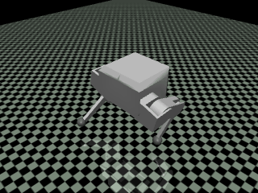

# Gnoci Sim

use like so:

```py

from src import GnociGymEnv
import gymnasium as gym
import numpy as np
from tqdm import tqdm


gym.register(
    id="gnoci_gym/Gnoci-v0",
    entry_point=GnociGymEnv,
)

env = gym.make("gnoci_gym/Gnoci-v0")
state, *_ = env.reset(seed=0)

for i in tqdm(range(100)):
    action = np.random.uniform(-1, 1, 6)
    state, reward, done, truncated, _ = env.step(action)

env.reset()

```



See also [this](https://colab.research.google.com/drive/13MDYzpxYmWT-9RKIIiF1CMuo6QNOUCGv?authuser=1) notebook